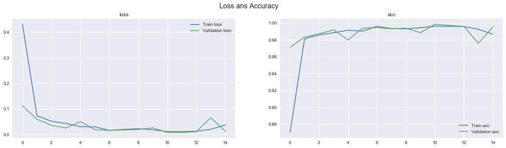

# Finger Counter:
A program that counts the number of fingers you're holding out. 

The data was collected using the webcome and OpenCV, and the Classification model is a CNN inmplemented in keras with Tensorflow as backend.

# Requirements
- pandas==0.23.0
- numpy==1.14.6
- matplotlib==3.0.2
- scikit-learn==0.19.1
- tensorflow==1.9.0
- Keras==2.2.2

# Contents
- **Finger Counter.ipynb** - jupyter notebook used for Creating the data, Training and testing the model.
- **gestures** - Folder containing the training images
- **checkpoint** - Folder containing a preatrained model
- **hand_emo** - Folder containing 

# Procedure
OpenCV was used as hand detector, we created a database consisting of 2000 images of binary masks, with 5 classes going from 1 to 5 fingers.
A keras model was used as a classifier. we train a simple model on 85% of the data and validate it on 15%.

# Training and Performance
The model is trained with TensorFlow backend using a  NVIDIA GeForce for 14 epochs using batches of 50 images each. The training input are not augmented, Augmentation techniques could improve the performance of this model.
A Testing performance of greater than 99% accuracy is achieved.

Model Learning loss and Accuracy is shown below

# Demo
Demo of Finger Counter Can be found here.
[https://www.youtube.com/watch?v=a0CjgK5weOg&feature=youtu.be](https://www.youtube.com/watch?v=a0CjgK5weOg&feature=youtu.be)

# Resources
- Emojinator [https://github.com/akshaybahadur21/Emojinator](https://github.com/akshaybahadur21/Emojinator)
- CNN-HowManyFingers [https://github.com/jaredvasquez/CNN-HowManyFingers](https://github.com/jaredvasquez/CNN-HowManyFingers)

# ToDo
- Add the Zero fingers case
- fine-tune ConvNet a bit more
- Collect more data
- use data augmentation
- use a CNN model for the detection phase